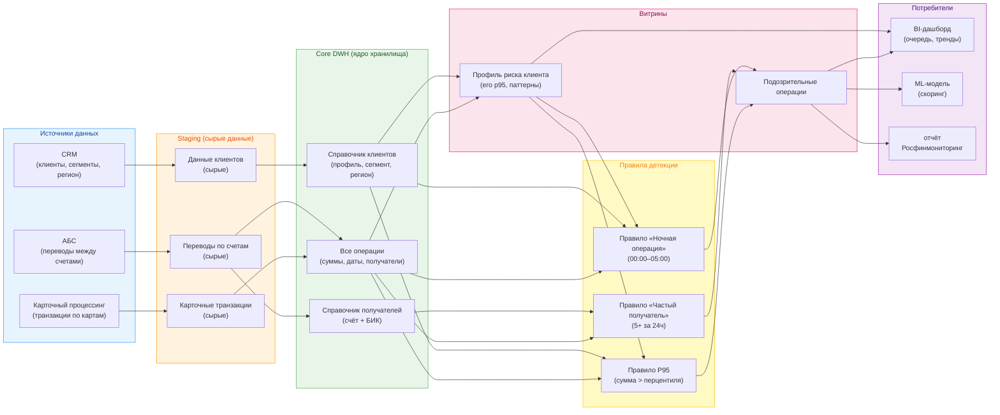

```mermaid
graph LR
    subgraph Sources["Источники данных"]
        PROC["Карточный процессинг\n(транзакции по картам)"]
        ABS["АБС\n(переводы между счетами)"]
        CRM["CRM\n(клиенты, сегменты, регион)"]
    end

    subgraph Staging["Staging (сырые данные)"]
        STG_TXN["Карточные транзакции\n(сырые)"]
        STG_TR["Переводы по счетам\n(сырые)"]
        STG_CL["Данные клиентов\n(сырые)"]
    end

    subgraph Core["Core DWH (ядро хранилища)"]
        DIM_CL["Справочник клиентов\n(профиль, сегмент, регион)"]
        DIM_RCP["Справочник получателей\n(счёт + БИК)"]
        FACT_TXN["Все операции\n(суммы, даты, получатели)"]
    end

    subgraph Rules["Правила детекции"]
        R1["Правило P95\n(сумма > перцентиля)"]
        R2["Правило «Частый получатель»\n(5+ за 24ч)"]
        R3["Правило «Ночная операция»\n(00:00–05:00)"]
    end

    subgraph Marts["Витрины"]
        MART_SUSP["Подозрительные операции"]
        MART_RISK["Профиль риска клиента\n(его p95, паттерны)"]
    end

    subgraph Consumers["Потребители"]
        BI["BI-дашборд\n(очередь, тренды)"]
        ML["ML-модель\n(скоринг)"]
        EXPORT["отчёт\nРосфинмониторинг"]
    end

    PROC --> STG_TXN
    ABS --> STG_TR
    CRM --> STG_CL

    STG_TXN --> FACT_TXN
    STG_TR --> FACT_TXN
    STG_CL --> DIM_CL
    STG_TR --> DIM_RCP

    FACT_TXN --> R1
    FACT_TXN --> R2
    FACT_TXN --> R3
    DIM_CL --> R1
    DIM_CL --> R3
    DIM_RCP --> R2
    MART_RISK --> R1
    MART_RISK --> R3

    R1 --> MART_SUSP
    R2 --> MART_SUSP
    R3 --> MART_SUSP
    FACT_TXN --> MART_RISK
    DIM_CL --> MART_RISK

    MART_SUSP --> BI
    MART_SUSP --> EXPORT
    MART_SUSP --> ML
    MART_RISK --> BI

    style Sources fill:#e8f4fd,stroke:#2196F3,color:#0d47a1
    style Staging fill:#fff3e0,stroke:#FF9800,color:#e65100
    style Core fill:#e8f5e9,stroke:#4CAF50,color:#1b5e20
    style Rules fill:#fff9c4,stroke:#FFC107,color:#f57f17
    style Marts fill:#fce4ec,stroke:#E91E63,color:#880e4f
    style Consumers fill:#f3e5f5,stroke:#9C27B0,color:#4a148c
```